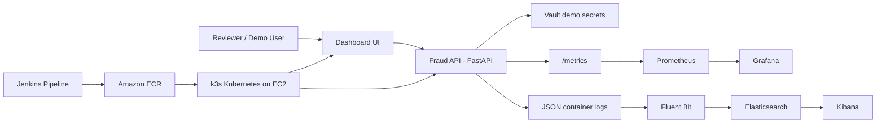

# FinGuard Lite - Global Fraud Intelligence DevOps Demo

FinGuard Lite is a simplified implementation of the case study. It shows the full DevOps flow without making the project too heavy for a viva:

- FastAPI fraud scoring service
- Static operational dashboard
- Docker containerization
- Kubernetes deployments with replicas, probes, autoscaling, and rollback
- Jenkins CI/CD pipeline
- GitHub repository flow for source control
- Terraform AWS EC2 + k3s cloud setup
- Prometheus, Grafana, ELK, and Vault demo manifests
- Demo scripts for fraud spike, network failure, pod outage, and rollback

## Architecture



The important viva explanation is simple: Jenkins builds and pushes images, Kubernetes runs them with replicas and probes, Prometheus/Grafana monitor metrics, ELK stores logs, Vault demonstrates secret storage, and Terraform creates the cloud machine.

For the GitHub-based CI/CD path, see `docs/github-jenkins.md`.

## Local Demo

Requirements:

- Docker
- Python 3.12 or Docker for tests
- kubectl for Kubernetes commands
- AWS CLI for cloud deployment
- Terraform for the AWS step

Run the app locally:

```bash
docker compose up --build -d fraud-api dashboard
```

Open:

- Dashboard: `http://localhost:8080`
- API health: `http://localhost:8000/health`
- API metrics: `http://localhost:8000/metrics`

Generate demo traffic:

```bash
./scripts/load_spike.sh
./scripts/network_failure.sh
```

Optional local observability:

```bash
docker compose --profile observability up -d prometheus grafana
```

Open:

- Prometheus: `http://localhost:9090`
- Grafana: `http://localhost:3000`
- Grafana login: `admin` / `admin`

Optional local Vault:

```bash
docker compose --profile security up -d vault
```

Open Vault at `http://localhost:8200` with token `finguard-root`.

Optional local ELK is heavier:

```bash
docker compose --profile logging up -d elasticsearch kibana
```

Open Kibana at `http://localhost:5601`.

Stop everything:

```bash
docker compose --profile observability --profile security --profile logging down
```

## AWS Cloud Demo

This project uses AWS because the AWS CLI is already available locally. Terraform is required for this step.

1. Create or choose an existing EC2 key pair in AWS.
2. Configure AWS credentials:

```bash
aws configure
```

3. Fill Terraform variables:

```bash
cp terraform/aws-ec2-k3s/terraform.tfvars.example terraform/aws-ec2-k3s/terraform.tfvars
```

Set:

- `key_name`
- `allowed_cidr`, preferably your public IP with `/32`
- `instance_type`, use `m7i-flex.large` when available so Prometheus, Grafana, Vault, and ELK can all run together

4. Create AWS resources:

```bash
cd terraform/aws-ec2-k3s
terraform init
terraform plan
terraform apply
```

5. Configure kubectl:

```bash
cd ../..
./scripts/setup_kubeconfig_from_ec2.sh <EC2_PUBLIC_IP> <PRIVATE_KEY_PATH>
export KUBECONFIG=./kubeconfig-finguard
kubectl get nodes
```

6. Deploy platform services:

```bash
kubectl apply -k k8s/vault
kubectl apply -k k8s/monitoring
kubectl apply -k k8s/logging
```

7. Build and push images to ECR:

```bash
ACCOUNT_ID=$(aws sts get-caller-identity --query Account --output text)
REGION=ap-south-1
REGISTRY="${ACCOUNT_ID}.dkr.ecr.${REGION}.amazonaws.com"

aws ecr get-login-password --region "${REGION}" | docker login --username AWS --password-stdin "${REGISTRY}"

docker buildx build --platform linux/amd64 \
  -t "${REGISTRY}/finguard-lite-fraud-api:latest" \
  --push apps/fraud-api

docker buildx build --platform linux/amd64 \
  -t "${REGISTRY}/finguard-lite-dashboard:latest" \
  --push apps/dashboard
```

8. Deploy FinGuard:

```bash
./scripts/create_ecr_pull_secret.sh finguard ap-south-1
kubectl apply -k k8s/base
kubectl -n finguard set image deployment/fraud-api fraud-api="${REGISTRY}/finguard-lite-fraud-api:latest"
kubectl -n finguard set image deployment/dashboard dashboard="${REGISTRY}/finguard-lite-dashboard:latest"
kubectl -n finguard rollout status deployment/fraud-api
kubectl -n finguard rollout status deployment/dashboard
```

9. Access the app:

```bash
cd terraform/aws-ec2-k3s
terraform output app_url
terraform output grafana_url
terraform output prometheus_url
terraform output kibana_url
```

## Jenkins Flow

The `Jenkinsfile` does this:

1. Runs API tests.
2. Builds Docker images.
3. Logs in to ECR.
4. Pushes images.
5. Applies Kubernetes manifests.
6. Updates deployment images.
7. Waits for rollout.
8. Rolls back automatically if deployment fails.

Jenkins needs Docker, AWS CLI, kubectl, AWS credentials, and a valid kubeconfig for the EC2 k3s cluster.

## Evaluation Scenarios

Fraud spike:

```bash
./scripts/load_spike.sh http://<EC2_PUBLIC_IP>/api/score 100
```

Payment network failure:

```bash
./scripts/network_failure.sh http://<EC2_PUBLIC_IP>/api/score
```

Infrastructure outage:

```bash
./scripts/pod_outage.sh
kubectl get pods -n finguard -w
```

Rollback:

```bash
./scripts/rollback.sh
```

Status:

```bash
./scripts/show_status.sh
```

## Case Study Mapping

| Requirement | Implementation |
| --- | --- |
| Infrastructure automation | Terraform creates ECR, EC2, security group, and k3s bootstrap |
| Containerized services | Dockerfiles for API and dashboard |
| Kubernetes deployments | Replicas, services, ingress, probes, HPA, PDB, network policy |
| CI/CD | Jenkins pipeline with test, build, push, deploy, and rollback |
| Monitoring | Prometheus scrapes `/metrics`; Grafana datasource and dashboard |
| Centralized logging | Fluent Bit forwards container logs to Elasticsearch; Kibana displays them |
| Security controls | Kubernetes Secret, Vault demo, ECR scanning, NetworkPolicy |
| Disaster recovery | Rolling updates, rollout undo, pod self-healing, scripted outage demo |

## Viva Explanation

Use this short explanation:

"FinGuard Lite is a cloud-native fraud detection demo. A transaction enters through the dashboard or API. The FastAPI service calculates a risk score using amount, velocity, failed logins, country, device, and payment network status. Kubernetes runs multiple replicas, so if a pod fails, another pod continues serving traffic. Jenkins automates tests, Docker image builds, ECR push, Kubernetes deployment, and rollback. Prometheus collects API metrics, Grafana visualizes latency and fraud decisions, Fluent Bit sends logs to Elasticsearch, Kibana shows those logs, and Vault demonstrates secret management. Terraform creates the AWS EC2 instance and bootstraps k3s, so the infrastructure is repeatable."

## Cleanup

Local:

```bash
docker compose --profile observability --profile security --profile logging down
```

AWS:

```bash
cd terraform/aws-ec2-k3s
terraform destroy
```
