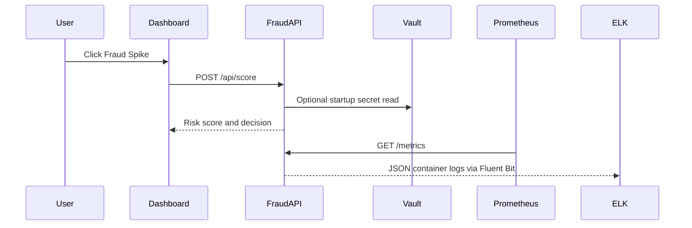

# FinGuard Lite Architecture

## Goal

The case study asks for a resilient DevOps ecosystem for real-time fraud analytics. This implementation keeps the architecture small enough to explain while still touching every required DevOps concept.

## Components

| Layer | Tool | Purpose |
| --- | --- | --- |
| Application | FastAPI | Scores transaction risk in real time |
| Dashboard | Nginx static UI | Shows recent transactions and demo controls |
| Containerization | Docker | Packages API and dashboard |
| Orchestration | Kubernetes/k3s | Runs replicas, health checks, rollout, rollback |
| Infrastructure | Terraform | Creates AWS EC2, security group, and ECR |
| CI/CD | Jenkins | Tests, builds, pushes, deploys, and rolls back |
| Metrics | Prometheus | Scrapes API metrics |
| Visualization | Grafana | Displays fraud and latency dashboards |
| Logs | Fluent Bit + Elasticsearch + Kibana | Centralizes application logs |
| Secrets | Vault demo + Kubernetes Secret | Demonstrates secret storage and injection |

## Request Flow

## Resilience Story

- API runs with 3 replicas.
- Dashboard runs with 2 replicas.
- Readiness probes stop traffic going to unhealthy pods.
- Liveness probes restart stuck pods.
- Rolling updates keep old pods alive while new pods start.
- PodDisruptionBudget keeps at least 2 API pods available.
- Rollback returns to the previous ReplicaSet if deployment fails.

## Security Story

- ECR image scanning is enabled.
- Kubernetes Secret holds sensitive values.
- Vault demo stores the same threshold and token values.
- NetworkPolicy allows API ingress only from the dashboard and monitoring namespace.
- Security group access can be restricted using `allowed_cidr`.

## Tradeoff

The project uses EC2 + k3s instead of EKS. EKS is more production-like, but EC2 + k3s is easier to deploy, cheaper, and better for a student viva where the panel needs to see and understand each moving part.
