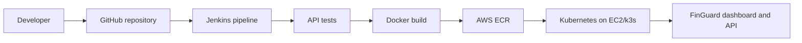

# GitHub and Jenkins Setup

This project uses GitHub as the source code repository and Jenkins as the CI/CD engine.

## Flow



## Create Local Git Repo

```bash
cd /Users/pernibharath/Desktop/Sem4_S2/Devops
git init
git add .
git commit -m "Initial FinGuard DevOps platform"
```

## Create GitHub Repo

Create a new empty repository on GitHub named:

```text
finguard-devops-platform
```

Do not add a README from GitHub because this project already has one.

Then connect and push:

```bash
git branch -M main
git remote add origin https://github.com/YOUR_USERNAME/finguard-devops-platform.git
git push -u origin main
```

## Jenkins GitHub Job

In Jenkins:

1. Create a new Pipeline job.
2. Choose **Pipeline script from SCM**.
3. SCM: **Git**.
4. Repository URL:

```text
https://github.com/YOUR_USERNAME/finguard-devops-platform.git
```

5. Branch:

```text
main
```

6. Script path:

```text
Jenkinsfile
```

## Jenkins Credentials Needed

Jenkins needs these credentials/tools:

- GitHub access if the repo is private.
- AWS credentials for ECR push and Kubernetes deployment.
- Docker available on the Jenkins agent.
- kubectl configured for the k3s EC2 cluster.

For this compact deployment, a simple approach is:

- Keep the GitHub repo public, or add GitHub credentials in Jenkins.
- Run Jenkins locally through Docker.
- Store AWS access keys in Jenkins credentials.
- Put the generated `kubeconfig-finguard` on the Jenkins machine.

## CI/CD Explanation

"GitHub is the source of truth for code. Jenkins reads the `Jenkinsfile` from GitHub, runs tests, builds Docker images, pushes them to Amazon ECR, and updates the Kubernetes deployment. This gives us repeatable CI/CD instead of manual deployment."
