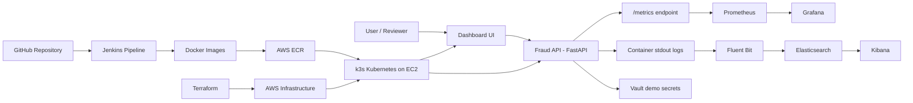

# FinGuard Lite - Global Fraud Intelligence Platform

## Project Report

**Project Title:** FinGuard Lite - Global Fraud Intelligence Platform  
**Domain:** Fraud detection, financial crime prevention, cloud-native DevOps  
**Repository:** `https://github.com/bharath-541/finguard-devops-platform`  
**Cloud Region:** AWS Asia Pacific (Mumbai), `ap-south-1`

---

## Live Project Links

| Platform | Link | Purpose |
| --- | --- | --- |
| GitHub Repository | [https://github.com/bharath-541/finguard-devops-platform](https://github.com/bharath-541/finguard-devops-platform) | Source code, Kubernetes manifests, Terraform files, Jenkinsfile, and documentation |
| Application Dashboard | [http://3.110.140.20](http://3.110.140.20) | Public FinGuard dashboard deployed on AWS |
| Prometheus | [http://3.110.140.20:30090](http://3.110.140.20:30090) | Metrics collection and query interface |
| Grafana | [http://3.110.140.20:30300](http://3.110.140.20:30300) | Metrics visualization and alerting interface |
| Kibana | [http://3.110.140.20:30561](http://3.110.140.20:30561) | Centralized log search and analysis |
| Jenkins | [http://localhost:8081](http://localhost:8081) | Local CI/CD pipeline dashboard |
| AWS EC2 Console | [EC2 Instances - ap-south-1](https://ap-south-1.console.aws.amazon.com/ec2/home?region=ap-south-1#Instances:) | EC2 instance running k3s |
| AWS ECR Console | [ECR Repositories - ap-south-1](https://ap-south-1.console.aws.amazon.com/ecr/repositories?region=ap-south-1) | Docker image repositories |
| AWS Security Groups | [Security Groups - ap-south-1](https://ap-south-1.console.aws.amazon.com/ec2/home?region=ap-south-1#SecurityGroups:) | Network access rules |
| AWS IAM Roles | [IAM Roles](https://us-east-1.console.aws.amazon.com/iam/home#/roles) | EC2 role and ECR access permissions |

Grafana login:

```text
Username: admin
Password: admin
```

Jenkins is intentionally local for this project. It runs inside Docker Desktop on the development machine, while the application itself is deployed on AWS.

---

## 1. Executive Summary

FinGuard Lite is a cloud-native fraud intelligence platform designed to demonstrate a complete DevOps ecosystem for real-time transaction risk analysis. The platform includes a fraud scoring API, an operational dashboard, automated infrastructure provisioning, containerized deployments, Kubernetes orchestration, CI/CD automation, observability, centralized logging, and secrets management.

The goal of this project is to show how a fraud detection platform can be built and operated reliably using modern DevOps practices. The system is designed to support real-time analytics, high availability, automated delivery, monitoring, logging, and recovery from failures.


---

## 2. Problem Statement

Financial institutions process large volumes of digital transactions. Fraud detection systems must analyze these transactions quickly and reliably. If the system is slow, unavailable, or difficult to update, fraudulent activity may go undetected.

The case study requires a DevOps solution that supports:

- Real-time fraud analytics
- High availability
- Scalability during fraud spikes
- Automated infrastructure provisioning
- Containerized services
- Kubernetes deployment
- CI/CD automation
- Monitoring and logging
- Security controls
- Rollback and recovery

---

## 3. Proposed Solution

The solution uses a compact but complete DevOps architecture:

```text
GitHub -> Jenkins -> Docker -> AWS ECR -> Kubernetes on AWS EC2
                                      |
                                      -> Prometheus + Grafana
                                      -> Fluent Bit + Elasticsearch + Kibana
                                      -> Vault

Terraform -> AWS EC2 + ECR + IAM + Security Group
```

The application is split into:

- `fraud-api`: FastAPI backend for transaction risk scoring
- `dashboard`: Nginx-hosted frontend dashboard

The platform is deployed on a lightweight Kubernetes cluster using k3s on AWS EC2.

---

## 4. Architecture Diagram




---

## 5. Technology Stack

| Category | Tool | Purpose |
| --- | --- | --- |
| Source control | GitHub | Stores source code and project history |
| CI/CD | Jenkins | Automates test, build, push, deploy, and rollback |
| Containerization | Docker | Packages API and dashboard into portable images |
| Local orchestration | Docker Compose | Runs services locally for development and demo |
| Infrastructure as Code | Terraform | Creates AWS resources automatically |
| Cloud platform | AWS | Hosts infrastructure and container image registry |
| Compute | EC2 | Runs the k3s Kubernetes cluster |
| Image registry | ECR | Stores Docker images built by Jenkins |
| Orchestration | Kubernetes/k3s | Runs containers with replicas, services, ingress, and rollout |
| CLI | kubectl | Manages Kubernetes resources |
| Metrics | Prometheus | Scrapes application and platform metrics |
| Visualization | Grafana | Displays metrics and supports alert rules |
| Logging | Fluent Bit | Collects Kubernetes container logs |
| Log storage | Elasticsearch | Stores and indexes logs |
| Log UI | Kibana | Searches and analyzes logs |
| Secrets | Vault | Demonstrates secure secret management |
| Frontend server | Nginx | Serves the dashboard and proxies API calls |

---

## 6. Application Design

### 6.1 Fraud API

The fraud API is built using FastAPI. It receives transaction input, calculates a risk score, and returns a fraud decision.

Important endpoints:

| Endpoint | Purpose |
| --- | --- |
| `/health` | Health check for probes and monitoring |
| `/metrics` | Prometheus metrics endpoint |
| `/api/score` | Scores a transaction and returns a decision |
| `/api/recent` | Shows recent scored transactions |

Risk decisions:

```text
Low risk    -> allow
Medium risk -> review
High risk   -> block
```


### 6.2 Dashboard

The dashboard is a static frontend served through Nginx. It provides a simple visual interface for transaction activity and fraud risk output.

The dashboard communicates with the backend through API routes and can be used to demonstrate the fraud scoring workflow.


---

## 7. Local Docker Workflow

Docker is used to package the backend and frontend services.

Local command:

```bash
docker compose up --build -d fraud-api dashboard
```

What happens:

1. Docker builds the fraud API image.
2. Docker builds the dashboard image.
3. Docker starts both containers.
4. The dashboard is exposed locally on port `8080`.
5. The API is exposed locally on port `8000`.

Why local Docker is useful:

- Confirms the app works before cloud deployment
- Provides a repeatable local environment
- Makes the application portable
- Reduces dependency mismatch problems


---

## 8. Infrastructure Automation With Terraform

Terraform is used to create AWS infrastructure as code.

Terraform folder:

```text
terraform/aws-ec2-k3s
```

Terraform creates:

- AWS EC2 instance
- AWS ECR repositories
- IAM role and instance profile
- Security group
- k3s bootstrap using EC2 user data

Terraform command flow:

```bash
terraform init
terraform plan
terraform apply
```

Explanation:

| Command | Purpose |
| --- | --- |
| `terraform init` | Initializes Terraform and downloads providers |
| `terraform plan` | Shows proposed AWS changes |
| `terraform apply` | Creates the actual AWS resources |

Why Terraform is used:

> Terraform makes infrastructure repeatable, documented, and automated. Instead of manually creating AWS resources, the infrastructure is defined in code.


---

## 9. AWS Cloud Resources

AWS is used for hosting the cloud environment.

### 9.1 EC2

EC2 hosts the k3s Kubernetes cluster.

Expected instance:

```text
Name: finguard-lite-k3s
Region: ap-south-1
Type: m7i-flex.large
```

Explanation:

> The EC2 instance acts as the compute server where the Kubernetes cluster runs.


### 9.2 ECR

ECR stores Docker images.

Repositories:

```text
finguard-lite-fraud-api
finguard-lite-dashboard
```

Explanation:

> Jenkins pushes Docker images to ECR, and Kubernetes pulls those images during deployment.


### 9.3 IAM

IAM is used to give secure permissions.

IAM role:

```text
finguard-lite-k3s-ecr-read
```

Explanation:

> The IAM role allows the EC2/k3s machine to pull images from ECR securely.


### 9.4 Security Group

The security group controls network access.

Important ports:

| Port | Purpose |
| --- | --- |
| 22 | SSH |
| 80 | Application dashboard |
| 443 | HTTPS placeholder |
| 6443 | Kubernetes API |
| 30090 | Prometheus |
| 30300 | Grafana |
| 30561 | Kibana |


---

## 10. Kubernetes Deployment

Kubernetes manifests are stored in:

```text
k8s/base
k8s/monitoring
k8s/logging
k8s/vault
```

### 10.1 Base Application Deployment

The base deployment creates:

- `finguard` namespace
- Fraud API deployment
- Dashboard deployment
- Services
- Ingress
- ConfigMap
- Secret
- HPA
- PDB
- NetworkPolicy

Command:

```bash
kubectl apply -k k8s/base
```

### 10.2 Kubernetes Concepts Used

| Resource | Purpose |
| --- | --- |
| Namespace | Separates project resources |
| Deployment | Runs and updates pods |
| Pod | Smallest runnable unit in Kubernetes |
| Service | Provides stable internal access to pods |
| Ingress | Exposes the dashboard publicly |
| ConfigMap | Stores non-sensitive configuration |
| Secret | Stores sensitive configuration |
| HPA | Supports autoscaling |
| PDB | Maintains availability during disruptions |
| NetworkPolicy | Controls allowed traffic |

### 10.3 Resilience

The app runs with multiple replicas:

```text
fraud-api: 3 replicas
dashboard: 2 replicas
```

If a pod fails, Kubernetes automatically creates a replacement pod.


---

## 11. CI/CD Pipeline With Jenkins

Jenkins automates the software delivery process.

Jenkins URL:

```text
http://localhost:8081
```

Jenkins is run locally using Docker Desktop for this project. The actual application deployment is still done on AWS.

Why Jenkins is local:

> Jenkins is self-hosted software. Running it locally keeps the setup cost-effective and simple for this project. In production, Jenkins can be hosted on EC2 or Kubernetes and triggered by GitHub webhooks.

### 11.1 Jenkins Pipeline Flow

```text
GitHub checkout
 -> API tests
 -> Docker image build
 -> Push images to ECR
 -> Deploy to Kubernetes
 -> Rollback if failure
```

### 11.2 Jenkins Stages

| Stage | What Happens |
| --- | --- |
| Checkout SCM | Jenkins pulls the latest code from GitHub |
| Test API | Runs API tests using pytest |
| Build Images | Builds fraud API and dashboard Docker images |
| Push to ECR | Authenticates with AWS and pushes images |
| Deploy Platform Addons | Optionally applies monitoring/logging/Vault manifests |
| Deploy FinGuard | Updates Kubernetes deployments with new images |
| Post Actions | Rolls back deployments if the pipeline fails |

### 11.3 Successful Pipeline Result

A successful Jenkins build proves:

- GitHub checkout works
- Tests pass
- Docker images build correctly
- Images are pushed to ECR
- Kubernetes deployment updates successfully
- Rollback was not needed


---

## 12. Docker Image Build And ECR Push

Jenkins builds Linux AMD64 images because the AWS EC2 instance runs on AMD64.

Build command pattern:

```bash
docker buildx build --platform linux/amd64 \
  -t <ecr-repo-url>:latest \
  --load \
  apps/fraud-api
```

Push command pattern:

```bash
docker push <ecr-repo-url>:latest
```

Why Buildx is used:

> The local Mac uses Apple Silicon, while the AWS EC2 instance uses AMD64. Docker Buildx allows Jenkins to build images for the target Linux AMD64 platform.


---

## 13. Monitoring With Prometheus And Grafana

### 13.1 Prometheus

Prometheus collects metrics from the fraud API.

Useful Prometheus queries:

```text
up
fraud_requests_total
fraud_decisions_total
```

The `up` query returns `1` when a target is healthy.

Example explanation:

> The `up` metric shows that Prometheus can scrape both itself and the FinGuard fraud API. A value of `1` means the target is reachable and healthy.


### 13.2 Grafana

Grafana connects to Prometheus and visualizes metrics.

Grafana is used for:

- Dashboards
- Metric visualization
- Alert rule configuration
- Operational monitoring

Explanation:

> Prometheus stores metrics, and Grafana provides a visual interface for those metrics.


---

## 14. Centralized Logging With ELK

Logging flow:

```text
Application stdout logs
 -> Kubernetes container logs
 -> Fluent Bit
 -> Elasticsearch
 -> Kibana
```

### 14.1 Fluent Bit

Fluent Bit collects logs from Kubernetes containers and forwards them to Elasticsearch.

### 14.2 Elasticsearch

Elasticsearch stores and indexes logs.

### 14.3 Kibana

Kibana is used to search and analyze logs.

Example proof:

```text
Data view: finguard
Index: finguard-logs
Logs: GET /health, GET /metrics
```

Explanation:

> Instead of checking logs pod by pod, logs are centralized in Elasticsearch and viewed through Kibana.


---

## 15. Secrets Management With Vault

Vault is included to demonstrate secure secret management.

Purpose:

- Store sensitive configuration
- Avoid hardcoding secrets in application code
- Demonstrate security best practice

Explanation:

> Vault provides a centralized way to manage secrets such as API keys, tokens, or sensitive thresholds.


---

## 16. Resilience And Recovery

The project demonstrates resilience through:

- Multiple API replicas
- Multiple dashboard replicas
- Kubernetes liveness probes
- Kubernetes readiness probes
- Rolling updates
- Rollback
- Pod self-healing
- Monitoring with Prometheus and Grafana
- Centralized logs with Kibana

### 16.1 Fraud Spike Simulation

Command:

```bash
./scripts/load_spike.sh http://3.110.140.20/api/score 25
```

Purpose:

> Sends multiple high-risk transactions to simulate a fraud spike.

### 16.2 Pod Outage Simulation

Command:

```bash
KUBECONFIG=./kubeconfig-finguard ./scripts/pod_outage.sh
```

Purpose:

> Deletes a pod and shows Kubernetes self-healing by creating a replacement pod.

### 16.3 Rollback

Command:

```bash
KUBECONFIG=./kubeconfig-finguard ./scripts/rollback.sh
```

Purpose:

> Rolls back the deployment to the previous working version.


---

## 17. End-To-End Request Flow

When a user opens the dashboard:

```text
Browser
 -> EC2 public IP
 -> Traefik ingress
 -> dashboard service
 -> dashboard pod
```

When the dashboard sends a scoring request:

```text
Dashboard
 -> Nginx API proxy
 -> fraud-api service
 -> one fraud-api pod
 -> risk score response
```

At the same time:

```text
Fraud API exposes metrics
Prometheus scrapes metrics
Grafana visualizes metrics
Fluent Bit collects logs
Elasticsearch stores logs
Kibana displays logs
```

---

## 18. End-To-End Deployment Flow

When code changes:

```text
Developer updates code
 -> Pushes code to GitHub
 -> Jenkins pulls latest code
 -> Jenkins runs automated tests
 -> Jenkins builds Docker images
 -> Jenkins pushes images to AWS ECR
 -> Jenkins updates Kubernetes deployment
 -> Kubernetes performs rolling update
 -> Prometheus and Kibana observe the running system
```

This is the complete CI/CD lifecycle.

---

## 19. Postman API Demonstration

A Postman collection is included for live backend API testing:

```text
docs/postman/finguard-api.postman_collection.json
```

The collection contains requests for:

- Health check
- Low-risk transaction scoring
- Medium-risk transaction scoring
- High-risk transaction scoring
- Payment network failure transaction scoring
- Recent transactions
- Prometheus metrics query

Postman demonstrates that the backend API can be executed live and returns real JSON responses. It is useful for showing backend behavior independently from the dashboard UI.

Recommended demo order:

1. Run `Health Check`.
2. Run `Score Transaction - Low Risk ALLOW`.
3. Run `Score Transaction - Medium Risk REVIEW`.
4. Run `Score Transaction - High Risk BLOCK`.
5. Run `Recent Transactions`.
6. Run `Prometheus Metrics`.

Example explanation:

> Postman is used to verify live backend API execution. The API accepts transaction details, calculates a risk score, returns a fraud decision, stores recent activity, and exposes metrics through Prometheus.

---

## 20. Validation Checklist

| Area | Validation |
| --- | --- |
| GitHub | Repository contains code, manifests, pipeline, and docs |
| Local Docker | API and dashboard run using Docker Compose |
| Terraform | AWS EC2, ECR, IAM, and security group are created |
| Kubernetes | Pods, services, ingress, monitoring, logging, and Vault are running |
| Jenkins | Pipeline passes successfully |
| ECR | Images are pushed with `latest` tag |
| Prometheus | `up` query returns `1` for targets |
| Grafana | Prometheus data source can be queried |
| Kibana | Logs are visible in Discover |
| Vault | Vault pod is running and seeded |


---

## 21. Conclusion

FinGuard Lite demonstrates a complete DevOps lifecycle for a real-time fraud intelligence platform. The system uses GitHub for source control, Docker for containerization, Terraform for infrastructure automation, AWS for cloud hosting, Kubernetes/k3s for orchestration, Jenkins for CI/CD, Prometheus and Grafana for monitoring, Fluent Bit, Elasticsearch and Kibana for centralized logging, and Vault for secret management.

The project satisfies the core requirements of infrastructure automation, containerized services, Kubernetes deployment, CI/CD automation, observability, centralized logging, security controls, and recovery through rollback and self-healing.

---

## 22. Short Explanation For Review

> FinGuard Lite is a cloud-native fraud detection platform. The backend API scores transactions, and the dashboard displays activity. Docker packages the services, Terraform creates AWS infrastructure, k3s Kubernetes runs the containers on EC2, Jenkins automates testing, image building, ECR push, and Kubernetes deployment, Prometheus and Grafana monitor metrics, ELK centralizes logs, and Vault demonstrates secure secret management.
